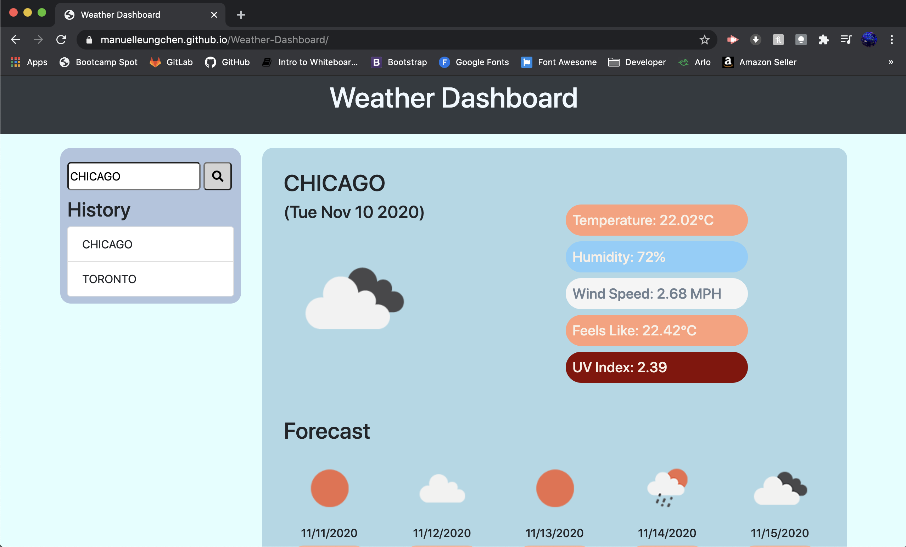

# Weather Dashboard
Weather Dashboard with Open Weather Map API

   

## Description
This repository **\([Weather Dashboard](https://github.com/manuelleungchen/Weather-Dashboard)\)** contains a Web Application that retrieve current weather information as well as a 5 day forecast on selected cities using the [Open Weather Map API](https://openweathermap.org/). The languages use on this website are **HTML 5**, **CSS**, **Bootstrap** and **JavaScript**. **JQuery** is use to dynamically updated HTML and CSS. This source code is available to everyone under the standard [MIT license](https://github.com/manuelleungchen/Weather-Dashboard/blob/main/LICENSE).

## Features
* Display current weather information
* Date are based on selected country timezone 
* Display weather info for the next 5 days
* Storage at maximum of 8 recent searched countries in local storage
* The last checked city weather is display at reload
* Autocomplete the searchbar with suggested city's name
* Responsive User Interface



## User Story

```
AS A traveler
I WANT to see the weather outlook for multiple cities
SO THAT I can plan a trip accordingly
```

## Acceptance Criteria

```
GIVEN a weather dashboard with form inputs
WHEN I search for a city
THEN I am presented with current and future conditions for that city and that city is added to the search history
WHEN I view current weather conditions for that city
THEN I am presented with the city name, the date, an icon representation of weather conditions, the temperature, the humidity, the wind speed, and the UV index
WHEN I view the UV index
THEN I am presented with a color that indicates whether the conditions are favorable, moderate, or severe
WHEN I view future weather conditions for that city
THEN I am presented with a 5-day forecast that displays the date, an icon representation of weather conditions, the temperature, and the humidity
WHEN I click on a city in the search history
THEN I am again presented with current and future conditions for that city
```

## Instructions

1. Go to [Weather Dashboard](https://manuelleungchen.github.io/Weather-Dashboard/)
2. Type a name of a city on searchbar
3. Click on search button

## Credits
All changes and improvements were implemented by:

Manuel Leung Chen [GitHub](https://github.com/manuelleungchen)

## License
Copyright \(c\) Microsoft Corporation. All rights reserved.

Licensed under the [MIT license](https://github.com/manuelleungchen/Weather-Dashboard/blob/main/LICENSE).

